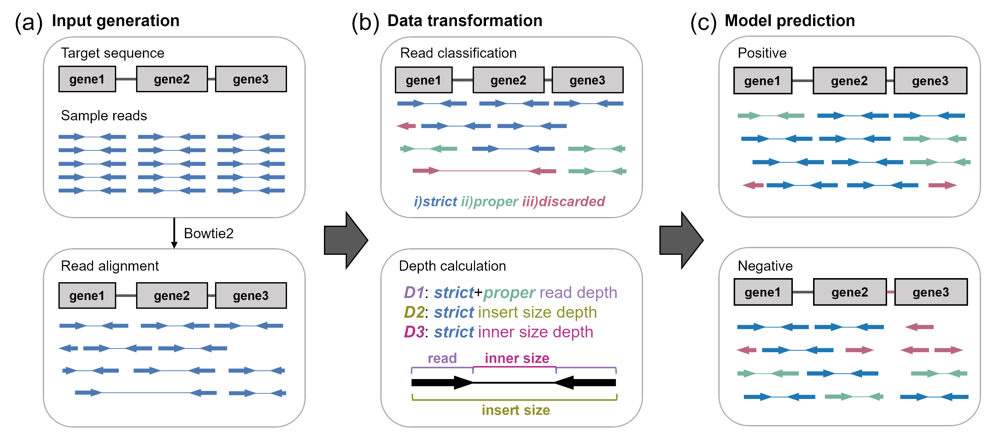

## DeepMobilome: predicting mobile genetic elements using sequencing reads of microbiomes

This repository includes the implementation of ' DeepMobilome: predicting mobile genetic elements using sequencing reads of microbiomes '. Please cite our paper if you use our models. Fill free to report any issue for maintenance of our model.

## Citation
If you have used DeepMobilome in your research, please cite the following publication:
Youna Cho, Mina Rho

## Overview
Here is the brief overview of DeepMobilome’s prediction workflow.

 

DeepMobilome predicts target MGEs through three phases: input generation, data transformation, and model prediction (Fig. 1).  
a) In the input generation phase, sample reads are aligned to the target MGE sequences using a read aligner such as Bowtie2.  
b) The read alignment information is processed in the data transformation phase.  
c) In the model prediction phase, DeepMobilome predicts the presence of the target MGEs in the sample based on the representation learned from the read mapping information.

## 1.Setup
We strongly recommend you to use python virtual environment with Anaconda/Miniconda.  
This model can run on GPU/TPU machine, but this is not mandatory.  
The details of the machine/environment we used are as follows:
+ NVIDIA Tesla V100 DGXS 32 GB graphic memory
+ CUDA 11.0
+ python 3.9.12
+ tensorflow=2.4.1

### 1.1 Build environment
```
git clone https://(gitclone site)
cd environment
conda env create -f DeepMobilome.yml
conda activate DeepMobilome
export PATH=/path/to/DeepMobilome/Script/:$PATH
```

## 2. Predict 

### 2.1 Running DeepMobilome *predict*
By providing a SAM file as input, it determines whether the target sequence is present or not based on the alignment information.  
You can find details of required/optional parameters for each function with -h option.
```
deepmobilome predict -h
```
```
usage: deepmobilome predict [-h] -i FILE -o FILE -l FILE -r FILE -c COUNT -a FILE -s SAVE

                    Predict Target

                    Input: Model weight, SAM file
                    Output: Predicted result

                    

optional arguments:
  -h, --help            show this help message and exit
  -i FILE, --inFile FILE
                        sam File : sample reads aligned to target sequence
  -o FILE, --outFile FILE
                        predicted result / samplename,Answer,Predict,AvgDepth / csv file
  -l FILE, --logFile FILE
                        log file
  -r FILE, --ref FILE   target sequence file / fna file
  -c COUNT, --count COUNT
                        read count / samplename,read count / csv file
  -a FILE, --ans FILE   answer for the given case / samplename,answer / csv file
  -s SAVE, --save SAVE  model weight
```
If you don't know the answer, just put either 0 or 1 for every given sample.


### 2.2 Tutorial
Predict existence of the target sequence in sample using the trained model.
Sample1 and sample2 are human data from [Cho, Y., et al., Deciphering Resistome in Patients With Chronic Obstructive Pulmonary Diseases and Clostridioides difficile Infections. Front Microbiol, 2022. 13: p. 919907.]

Target sequence is 'IS26/AAC(6')-Ie-APH(2'’)-Ia/N-acetyltransferase/IS26'

```
cd tutorial/

```

### 2.2.1 Positive sample
Predict positive sample as positive

```
deepmobilome predict \ 
--inFile positive_sample/sample1_target1.sam \
-o output/sample1Target1.csv -l output/sample1Target1.log \
--ref target/Target1seq.fna --count positive_sample/sample1_read_detail.txt \
--ans positive_sample/sample1target1answer.csv --save ../model/DeepMobilome_weight.h5
```

```
[Prediction example]
Sample,Answer,Predicted,AvgDepth
sample1_target1_Target1,1,1,148.44
```


### 2.2.2 Negative sample
Predict negative sample as negative

```
deepmobilome predict \
--inFile negative_sample/sample2_target1.sam \
-o output/sample2Target1.csv -l output/sample2Target1.log \
--ref target/Target1seq.fna --count negative_sample/sample2_read_detail.txt \
--ans negative_sample/sample2target1answer.csv --save ../model/DeepMobilome_weight.h5
```

```
[Prediction example]
Sample,Answer,Predicted,AvgDepth
sample2_target1_Target1,0,0,161.63
```


## 3. Train
For training a new model, DeepMobilome offers three functions: *preprocess*, *shuffle*(optional), and *train*.
```
deepmobilome {prep, shuffle, train} [options]
```

You can find details of required/optional paramters for each functions with -h option.

You can walk-through all the process using the data from "tutorial/train" directory.
```
cd tutorial/train/
```

### 3.1 Running DeepMobilome *preprocess*
In this stage, SAM files are transformed to plk files, extracting read alignment information.
This step is necessary because, unlike the predict function, we need to handle huge number of SAM files with multiple target sequences. 

```
deepmobilome prep -h
```

```
usage: deepmobilome prep [-h] -i FILE -in DIR -o FILE -r FILE -c COUNT -a FILE [-nm NM] [-s SR]

optional arguments:
  -h, --help            show this help message and exit
  -i FILE, --inFile FILE
                        sam File list
  -in DIR, --inDir DIR  sam File directory
  -o FILE, --outPre FILE
                        output File prefix {outPre}.log, {outPre}.plk
  -r FILE, --ref FILE   bowtie reference file
  -c COUNT, --count COUNT
                        read count list
  -a FILE, --ans FILE   Answer of the given case, samplename and answer, csv file
  -nm NM, --nm NM       mapped read nm ratio default : 0.9
  -s SR, --sr SR        soft clipped ratio defalut : 0.5
```
Run preprocess
```
cd tutorial/train/1Preprocess/

deepmobilome prep \
--inFile input/sam/list.txt --inDir input/sam/ \
-o output/testTarget1 --ref input/target/Target1seq.fna \
--count input/fastq/read_detail.txt  --ans input/target/Target1answer.csv
```

### 3.2 Running DeepMobilome *shuffle* (optional)
In this step, the .plk files generated in the previous stage is shuffled.  
This step is optional and can be performed to decrease size of each .plk files and increase randomness.  
```
deepmobilome shuffle -h
```
```
usage: deepmobilome shuffle [-h] -i FILE -in DIR -o FILE [-b BATCH] [-s SFL]

optional arguments:
  -h, --help            show this help message and exit
  -i FILE, --inFile FILE
                        plk file list
  -in DIR, --inDir DIR  input plk directory
  -o FILE, --outPre FILE
                        output prefix
  -b BATCH, --batch BATCH
                        batch size : default 256
  -s SFL, --sfl SFL     number of lines to shuffle : default 100

```
Run shuffle
```
cd tutorial/train/2Shuffle/

deepmobilome shuffle --inFile input/plkList.txt -in input/ -o output/shuffled
```

### 3.3 Running DeepMobilome *train*
In this step, the model is trained using the .plk files
```
deepmobilome train -h
```
```
usage: deepmobilome train [-h] -i FILE -in DIR -o FILE

optional arguments:
  -h, --help            show this help message and exit
  -i FILE, --inFile FILE
                        plk file list
  -in DIR, --inDir DIR  input plk directory
  -o FILE, --outPre FILE
                        output prefix
```
Run train
```
cd tutorial/train/3Train/

deepmobilome --inFile input/list.txt -in input/ -o output/Testmodel1
```

### 3.4 Running DeepMobilome *predict*
You can test the new model using predict function.
```
cd tutorial/train/4Predict/

deepmobilome predict \
--inFile input/positive_sample/sample1_target1.sam \
-o output/predictTest.csv -l output/predictTest.log \
--ref input/target/Target1seq.fna --count input/positive_sample/sample1_read_detail.txt \
--ans input/positive_sample/sample1target1answer.csv \
--save ../3Train/output/Testmodel1_weights.h5

```
